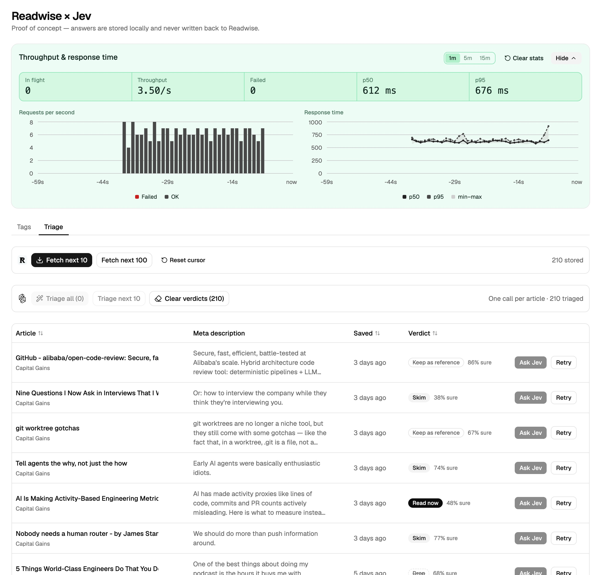

# Readwise x Jev classifier

Proof of concept. Reads the Readwise Reader inbox and asks Jev one question set
per article. Two pages ask different questions about the same inbox. Tags scores
an article against 23 tags. Triage picks one verdict for it. It never writes
back to Readwise.



## Setup

Needs Node 22.18 or newer. `npm test` runs TypeScript through `node --test`
with no build step.

1. Install dependencies:

   ```
   npm install
   ```

2. Copy `.env.example` to `.env` and add both keys:

   ```
   READWISE_TOKEN=...      # https://readwise.io/access_token
   TYPESAFE_API_KEY=...    # https://typesafe.ai
   ```

3. Put the PocketBase binary at `pocketbase/pocketbase`. The repo does not ship
   it. Download the build for your platform from
   [the releases page](https://github.com/pocketbase/pocketbase/releases) and
   unzip it there. Developed against 0.40.

4. Start PocketBase. It applies the migrations in `pb_migrations/` on first run:

   ```
   npm run pb
   ```

5. Start the UI in a second terminal:

   ```
   npm run dev
   ```

Open http://localhost:5173.

## Tags

`src/lib/tags.ts` holds 23 tags in three groups: 12 tech, 4 product and work, 7
broad interest. Each tag is one Jev `noul` question and returns a probability
from 0 to 1. All 23 go out in one request per article. A probability of 0.80 or
more applies the tag.

The prompts follow TypeSafe's System One guidance. Each `question` is one short
proposition, because a long question hides several judgments behind one answer.
The scope lives in `criteria.true.what`. `inspect` points every question at the
`title` and `description` fields.

Granular tags overlap. A React server component post is frontend and web. A
Kubernetes post is infra and backend. Each tag therefore carries contrastive
criteria: `what` states the case, `examples` give matching article titles, and
the `false` examples are near-misses a sibling tag should win. Those boundaries
keep Jev off 0.50 on the overlapping pairs. Add `focus` only where a sibling
would otherwise absorb the article.

To add a tag, copy an existing entry and write both sides of its boundary.
`npm test` validates the shape, including the question length limit.

Tag ids are the question keys sent to Jev and stay plain identifiers
(`web_platform`). `label` carries the form shown in the UI (`web-platform`). A renamed
id orphans any score stored under the old key, and the row still counts as
scored, so use "Retry" on it.

## Fetching

"Fetch next 10" reads one page of the inbox, filtered to `location=new` and
`category=article`. PocketBase keeps the Readwise page cursor in the
`sync_state` collection, so the next click returns the next articles and never
repeats. A unique index on `readwise_id` is the second guard: a repeated
document updates its row and keeps its scores. "Reset cursor" starts from the
top of the inbox again.

## Scoring

"Auto tag all" scores every unscored article, four requests at a time. Per row,
"Auto tag" scores an article for the first time and "Retry" scores it again.
Jev returns 429 when rate limited and 529 when overloaded. The client retries
both with exponential backoff.

A noul value is its own confidence, so a middle score means "cannot tell"
rather than no. The tag column shows scores from 40 to 79 under "unsure"
instead of dropping them, which is where to look when a boundary needs
sharpening.

## Triage

The second page (`#triage`) asks one question per article and returns a single
verdict: read now, skim, keep as reference, or drop. It is the one place that
uses a System One `choice`. The answer carries a probability across all four
options, and `confidence` collapses that spread into the number shown beside
the verdict.

Each verdict states `what` it covers, a `not_for` naming the sibling most
likely to take the article instead, and two example titles. Criteria describe
the article, never the reader, because Jev sees a title and a meta description
and cannot know who is asking. The page stores verdicts in the `triage` field,
and "Clear verdicts" removes them.

## Credentials

Readwise and Jev both refuse browser requests and need secrets. The Vite dev
server proxies `/readwise` and `/jev` and adds the `Authorization` header, so
neither key reaches the browser. This works in `npm run dev` only.

## Layout

| Path                               | Contents                                       |
| ---------------------------------- | ---------------------------------------------- |
| `src/lib/tags.ts`                  | Tag definitions, boundaries, threshold         |
| `src/lib/triage.ts`                | Triage question set, verdicts, the two scales  |
| `src/lib/jev.ts`                   | Jev client, backoff, concurrency pool, the run |
| `src/lib/readwise.ts`              | Inbox fetch and cursor handling                |
| `src/lib/pb.ts`                    | PocketBase client and record types             |
| `src/hooks/use-jev-run.ts`         | Run state shared by both pages                 |
| `src/pages/`                       | One file per page                              |
| `src/components/article-table.tsx` | The table, minus the column each page owns     |
| `pb_migrations/`                   | PocketBase collections                         |

Zod validates the two external responses and the two environment variables.
PocketBase records are not re-validated, because this application is the only
writer.

## License

MIT. See [LICENSE](./LICENSE).
